The site here created is used to post job applications from a single organisation, where multiple users can apply for jobs. The site admin/employer can then review the cover letters provided by the applicants. 

Table of content

## Planning
### Site aims
The aim of this site is the create a fictional company in need of employees. 

The site will have a single employer who will be able to add new job listings, edit current ones and delete ones that do not need to be advertised anymore. 

The Employer will be able to keep jobs in draft mode untill they are ready to publish them. 

While the Employer will be able to see the job applications from registered users. 
The user wil be able to view the job listings and select which eveer one they deem most suitable for themselves. 

They will be able to submit a cover letter to a specific job. 

## Scope
- Must have **USER** functions
    - User can login /logout
    - User can view job listings
    - User can apply for job listings
    - User can edit own profile page

- Must have **EMPLOYER** functions
    - Employer can login / logout
    - Employer can add job listings
    - Employer can edit job lisings
    - Employer can delete job listings
    - Employer can draft job listings
    - Employer can view job aplpications

- Should have **USER** functions
    - View landing page 
    - User can save jobs 

- Should have **EMPLOYER** functions
    - View how many saves of a job 

- Not recommended at this time
    - Direct text chat with employer/user
    - View amount of applicants for a job 
    - Attachment of CV file to the site 
    - Employer details 

    
## Structure
        Show how the site works in base functiuonality drawing

### Wireframes

## User stories

| Number | User Story                 | Description                                                 | Competed    |
| :----: | :----:                     |    :----:                                                   |         :----:|
#1       | Register for the site      | As a USER I can REGISTER FOR THE SITE so that I CAN VIEW JOB LISTINGS       | Yes  |
#2       | Log in to site             | As a USER I can LOGIN TO THE SITE so that I CAN APPLY FOR JOBS THROUGHT THE SITE     | Yes  |
#3       | Log out of site            | As a USER I can LOG OUT OF THE SITE so that I CAN FINISH MY SESSION         | Yes  |
#4       | Edit account details       | As a USER I can EDIT MY PROFILE DETAILS so that I CAN HAVE AN UP TO DATE ACCOUNT      | Yes  |
#5       | View job listing           | As a USER I can VIEW JOB LISTINGS so that I CAN SEE THE DETAILS OF THE JOBS POSTED     | Yes  |
#6       | Save Job Listing           | As a USER I can SAVE A JOB so that I CAN COME BACK TO VIEW IT AGAIN TO APPLY     | Yes  |
#7       | Delete saved job           | As a USER I can DELETE A SAVED so that I CAN ONLY HAVE FAVOURITED JOBS IN MY SAVED PAGES  | Yes  |
#8       | Apply for a job            | As a USER I can APPLY FOR A JOB so that THE COMPANY CAN SEE MY AS A VIABLE APPLICANT     | Yes  |
#9       | Submit a cover letter      | As a USER I can SUBMIT A COVER LETTER so that MY EXPERINCE CAN ME SHOWCASED       | Yes  |
#10      | Create a job listing       | As a EMPLOYER I can CREATE A JOB LISTING so that PEOPLE CAN BE INFORMED ABOUT A JOB OPENING AND CAN APPLY       | Yes  |
#11      | Delete a job listing       | As a EMPLOYER I can DELETE THE JOB LISTING so that THE JOB WILL NO LONGER BE AVAILABE TO BE APPLIED FOR   | Yes  |
#12      | Update a job listing       | As a EMPLOYER I can UPDATE THE JOBLISTING so that IT CAN BE KEPT UP TO DATE  |Yes   |
#13      | View job applications      | As a EMPLOYER I can VIEW ALL JOB APPLICATIONS so that I CAN CHOOSE THE RIGHT APPLICANT        | Yes    |
#14      | View number of times a job listing has been viewed| As a EMPLOYER I can VIEW THE NUMBER OF TIMES A JOB HAS BEEN VIEWED so that I CAN KNOW IF THE JOB IS POPULAR| Yes   |
#15      | View Cover letters| As a EMPLOYER I can VIEW THE COVER LETTER ONLY so that SO THAT NOBODY APART FFROM THE ADMIN CAN HAVE ACCES TO CONFIDENTIAL INFORMATION| Yes     |
#16      | Authorisation for editing and deletion| As a EMPLOYER I can HAVE THE AUTHORITY TO EDIT AND DELETE JOB LISTINGS so that NOBODY ELSE CAN ADJUST MY LISTINGS IN A MLICIOUS WAY        | Yes      |
#17      | View Job Listings   | As a USER I can VIEW JOB LISTINGS so that CHOOSE WHAT JOB I WAN TO APPLY FOR        | Yes      |
#18      | Add Job   | As a EMPLOYER I can ADD A NEW JOB TO THE LISTINGS so that I CAN ADVERTISE JOB OPENINGS FROM THE COMPANY        |  Yes    |
#19      |View and publish draft jobs| As a ADMIN I can VIEW, EDIT and PUBLISH JOBS so that NEW JOB LISTINGS CAN BE VIEWED BY THE APPLICANTS| Yes
Agile Development

 ## Features

### Navigation
The navigation bar on the top of the page reflects 3 different stages of the site. 
First stage is for a user or admin that is not signed in. It shows an option to log in or register
    Signed out
Second stage is that or a logged in user. The Nav bar then shows an option to edit user profile or view job listings
    Signed in
The third stage is where an ADMIN is logged in, this has more access to the site, it allows the admin to add a new job listing and view applicants for the jobs posted. 
       Signed in as admin
        

### Images
        Show images used for the sites 

### Authorisation pages 
For the site we have the ability to register and sign in for the site. This functionality is provided through the DJANGO framework and allows for automatic authorisation of the new or existing user. 

Sign In page

 
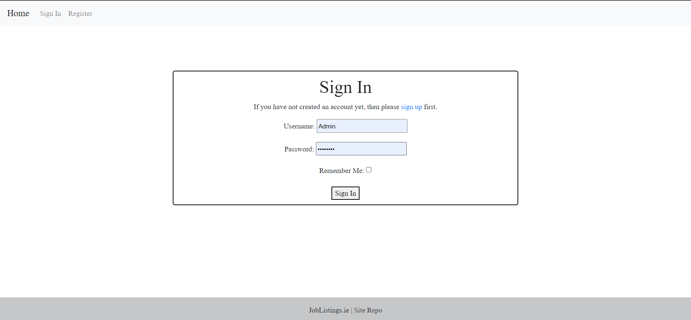

Sign Out Page

 
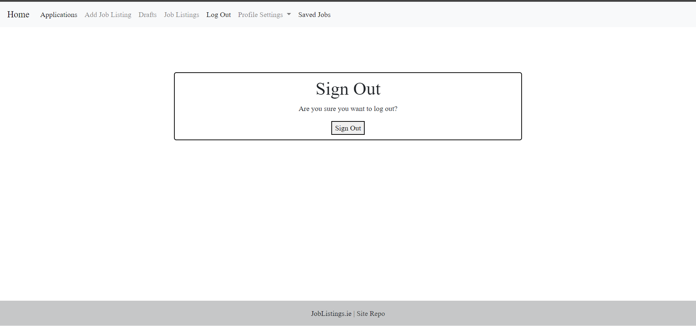

Register

 
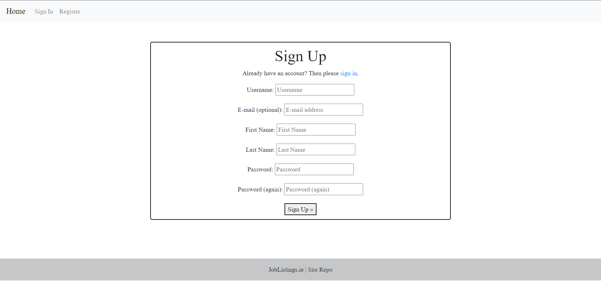

 

### Job Listing Page
The Job listing page is located in two sections of the site. 
First, it is seen on the home page of the site, where a user is greeted and encouraged to view jobs or to register for the site.
Once this is completed, the user may view the job listings with the ability to apply for jobs they find applealing.  

Job Listing Page

 
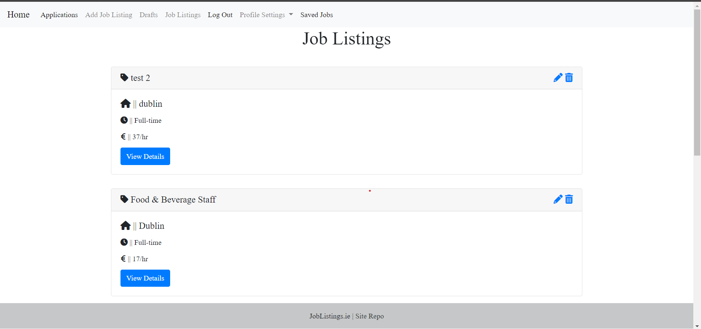

 

### Job Add Page 
The ADMIN had the sole role of adding new job listings to the site. 
The add job page has a form that contains all the fields which need to be filled out so that it can be validated and sent to a database. 

Job Add Page

 
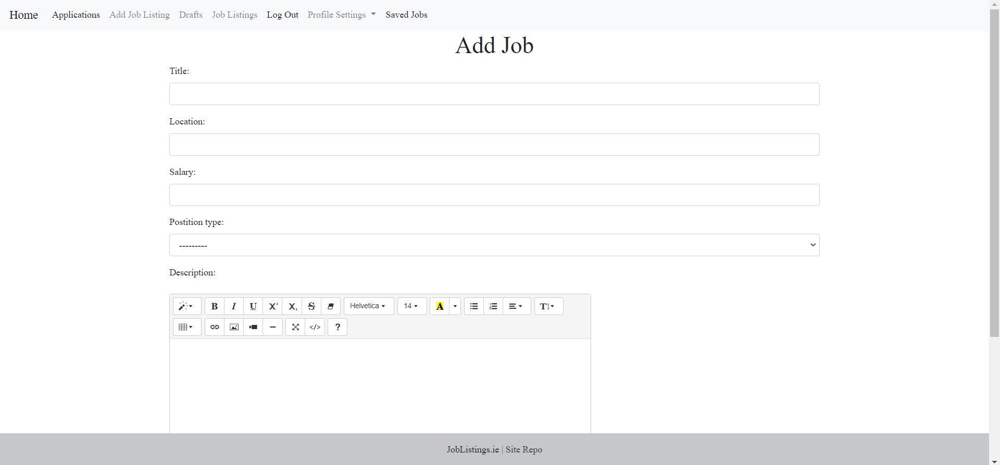

 

### Job edit
The ADMIN had the sole role of editing listings on the site. 
The page form comes prepopulated with the current details of the job and once all the relevant fields are updated, the form can be sent out to be re-listed on the site. 

Edit Job

 
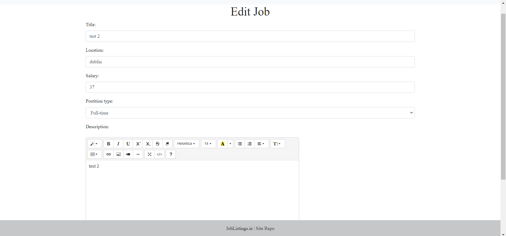

  

### Job Delete
The ADMIN had the sole role of deleting a job listings on the site. 
The page shows a warning message 

Delete Job

 
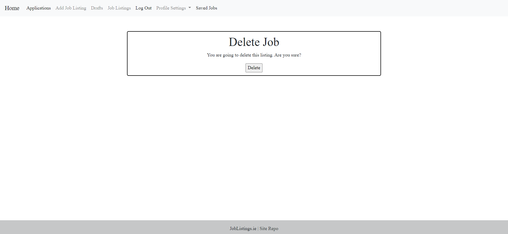

 
    
### Job Details Page/ Job Application Page
The details page shows the all the advertised details for the job. This page can be viewed if a user is logged in only.  
This page also has an application section. This section can only be viewed if the user is logged in. 

Job Details

 
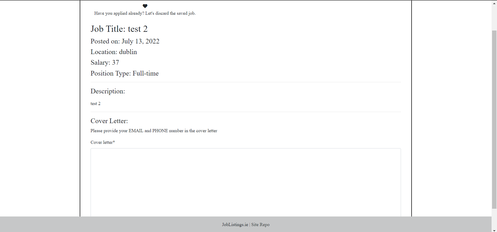

 

Application Section

 
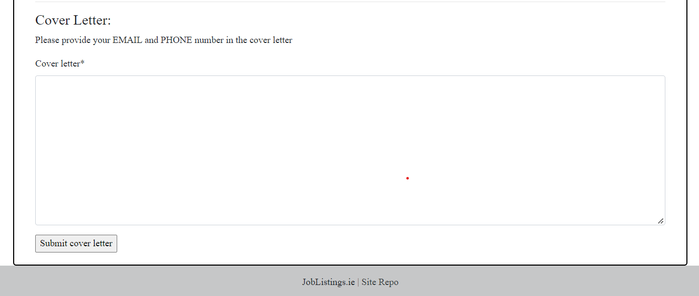

 

### Admin Job Drafts Page
The admin may view job listings that have not yeyt been published. The job listing then may be edited, deleted or published to the site so that new applicants may apply for the job.

Drafts

 
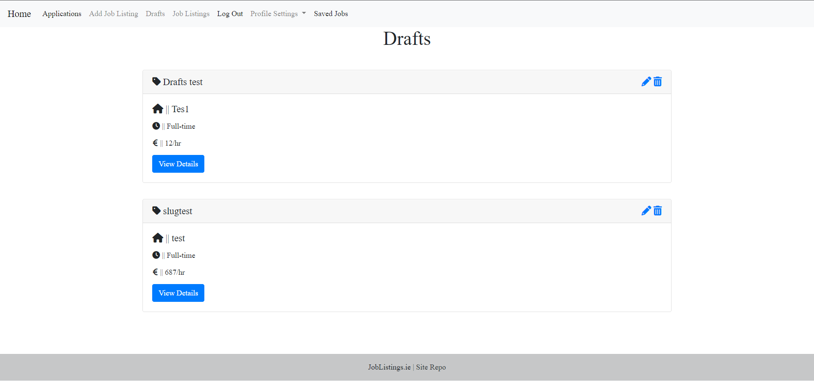

 

### Admin View applications
The Admin is solely able to view applications that have been submited by the users. 
This section allows the admin to view the details of the posted job, the cover letter and a link to the applicants profile

Job Applications Section

 
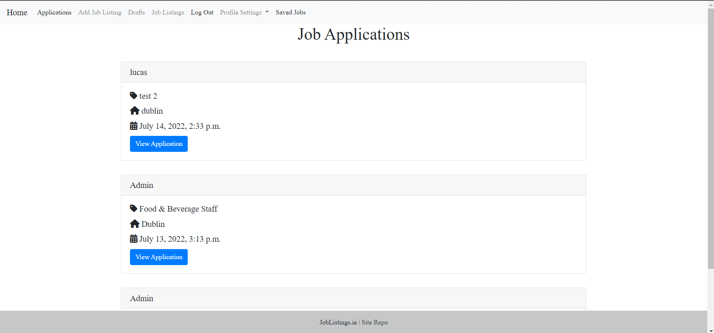

 

Job Application Details

 
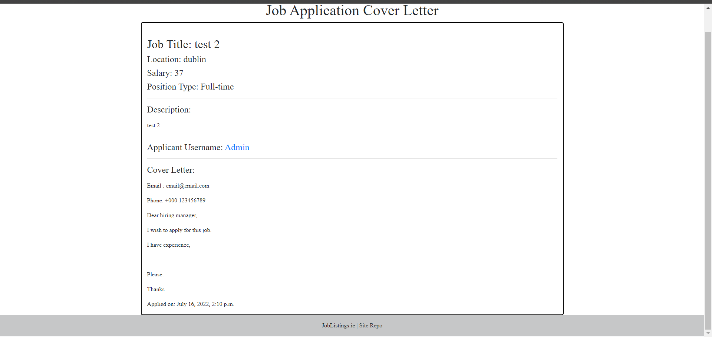

 

### Profile
Users may fill out their details in their own profile page. This page is linked to each job application they take part in. 

Profile Page

 
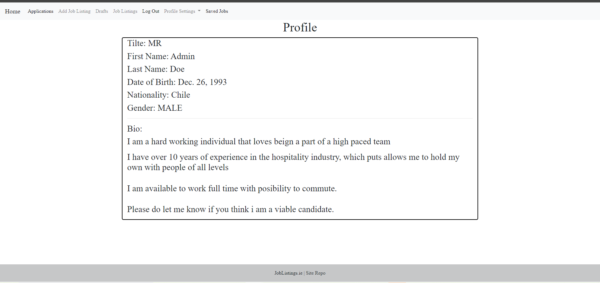

 

### Edit Profile
The user has the ability to update their profile details including their bio. 

Edit Profile Page

 
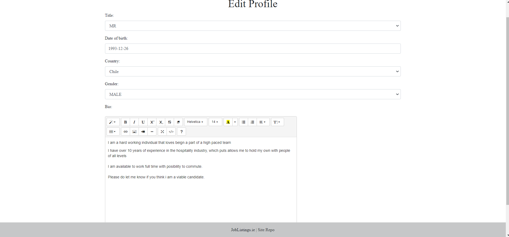

 

### Contact details 
The contact details for the company can be found in the footer of the page 
        PLaced in footer

### Pagination
Pagination of the listings allows for the display of a limited amount of jobs on one page before being asked to go to the next page if there are more than 5 job listings. 
        Allows to show a certain number of items on pages before moving tyo another opage

### Adding Modals as defensive programing
Modals are used here as a way to ask the user if they wish to either complete an update or the deletion of a job listing. This prevents the accidental deletion of ajob listing.
        Add a modal to show that a deleption is irreversible 

## Testing 
    Either manual or automatic

## Deployment 

### How to Clone the Repository 

- Go to the https://github.com/NowickiLukasz/job-listing-site-ci-pp4 repository on GitHub 
- Click the "Code" button to the right of the screen, click HTTPs and copy the link there
- Open a GitBash terminal and navigate to the directory where you want to locate the clone
- On the command line, type "git clone" then paste in the copied url and press the Enter key to begin the clone process
- To install the packages required by the application use the command : pip install -r requirements.txt
- When developing and running the application locally set DEBUG=True in the settings.py file
- Changes made to the local clone can be pushed back to the repository using the following commands :

  - git add *filenames*  (or "." to add all changed files)
  - git commit -m *"text message describing changes"*
  - git push

- N.B. Any changes pushed to the master branch will take effect on the live project once the application is re-deployed from Heroku

### Create Application and Postgres DB on Heroku
- Log in to Heroku at https://heroku.com - create an account if needed.
- From the Heroku dashboard, click the Create new app button.  For a new account an icon will be visible on screen to allow you to Create an app, otherwise a link to this function is located under the New dropdown menu at the top right of the screen.
- On the Create New App page, enter a unique name for the application and select region.  Then click Create app.
- On the Application Configuration page for the new app, click on the Resources tab.
- In the Add-ons search bar enter "Postgres" and select "Heroku Postgres" from the list - click the "Submit Order Form" button on the pop-up dialog.
- Next, click on Settings on the Application Configuration page and click on the "Reveal Config Vars" button - check the DATABASE_URL has been automatically set up. 
- Add a new Config Var called DISABLE_COLLECTSTATIC and assign it a value of 1.
- Add a new Config Var called SECRET_KEY and assign it a value - any random string of letters, digits and symbols.
- The settings.py file should be updated to use the DATABASE_URL and SECRET_KEY environment variable values as follows :

  - DATABASES = {'default': dj_database_url.parse(os.environ.get('DATABASE_URL'))}

  - SECRET_KEY = os.environ.get('SECRET_KEY')

- In Gitpod, in the project terminal window, to initialize the data model in the postgres database, run the command : python3 manage.py migrate 
- Make sure the project requirements.txt file is up to date with all necessary supporting files by entering the command : pip3 freeze --local > requirements.txt
- Commit and push any local changes to GitHub.
- In order to be able to run the application on localhost, add SECRECT_KEY and DATABASE_URL and their values to env.py

### Configure Cloudinary to host images used by the application
- Log in to Cloudinary - create an account if needed.  To create the account provide your name, email and set up a password.  For "primary interest" you can choose "Programmable Media for image and video API".  Click "Create Account" and you will be sent an email to verify your account and bring you to the dashboard.
- From the dashboard, copy the "API Environment variable" value by clicking on the "Copy to clipboard" link.
- Log in to Heroku and go to the Application Configuration page for the application.  Click on Settings and click on the "Reveal Config Vars" button.
- Add a new Config Var called CLOUDINARY_URL and assign it the value copied from the Cloudinary dashboard, but remove the "CLOUDINARY_URL=" at the beginning of the string. 
- In order to be able to run the application on localhost, also add the CLOUDINARY_URL environment variable and value to env.py

### Connect the Heroku app to the GitHub repository
- Go to the Application Configuration page for the application on Heroku and click on the Deploy tab.
- Select GitHub as the Deployment Method and if prompted, confirm that you want to connect to GitHub. Enter the name of the github repository (the one used for this project is (https://github.com/NowickiLukasz/job-listing-site-ci-pp4) and click on Connect to link up the Heroku app to the GitHub repository code.
- Scroll down the page and choose to either Automatically Deploy each time changes are pushed to GitHub, or Manually deploy - for this project Manual Deploy was selected.
- The application can be run from the Application Configuration page by clicking on the Open App button.
- The live link for this project is (https://job-forum-ci.herokuapp.com/)

### Final Deployment steps
Once code changes have been completed and tested on localhost, the application can be prepared for Heroku deployment as follows :
- Set DEBUG flag to False in settings.py
- Ensure requirements.txt is up to date using the command : pip3 freeze --local > requirements.txt
- Push files to GitHub
- In the Heroku Config Vars for the application delete this environment variable :  DISABLE_COLLECTSTATIC
- On the Heroku dashboard go to the Deploy tab for the application and click on deploy branch

## Tech Used 
    python
    Django
    Heroku
    Heroku PostgrSQL
    HTML
    CSS
    JINJA
    Boostrap
    Font Awesome
    Balsamiq

## Sources

- Auto creating slugs for unpublished job listings
    - (https://stackoverflow.com/questions/50436658/how-to-auto-generate-slug-from-my-album-model-in-django-2-0-4)
- Auto creating user profile with signals
    - (https://ordinarycoders.com/django-custom-user-profile)
- Adding job listings to favourites
    - (https://www.youtube.com/watch?v=1XiJvIuvqhs&ab_channel=AbhishekVerma)

## Credits
- Inspiration taken from: how to build job portal
    - (https://techvidvan.com/tutorials/online-job-portal-python-django/)
- Inspiration taken from: How to build a blog
    - (https://www.youtube.com/watch?v=B40bteAMM_M&list=PLCC34OHNcOtr025c1kHSPrnP18YPB-NFi&ab_channel=Codemy.com)
- Messages 
    - (https://pythonprogramming.net/messages-django-tutorial/)
    
    
