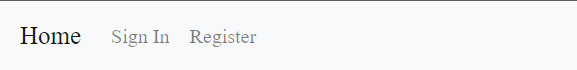
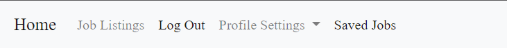
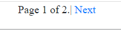

The site here created is used to post job applications from a single organisation, where multiple users can apply for jobs. The site admin/employer can then review the cover letters provided by the applicants. 


Table of content

## Planning
### Site aims
The aim of this site is the create a fictional company in need of employees. 

The site will have a single employer who will be able to add new job listings, edit current ones and delete ones that do not need to be advertised anymore. 

The Employer will be able to keep jobs in draft mode untill they are ready to publish them. 

While the Employer will be able to see the job applications from registered users. 
The user wil be able to view the job listings and select which eveer one they deem most suitable for themselves. 

They will be able to submit a cover letter to a specific job. 

## Scope
- Must have **USER** functions
    - User can login /logout
    - User can view job listings
    - User can apply for job listings
    - User can edit own profile page


- Must have **EMPLOYER** functions
    - Employer can login / logout
    - Employer can add job listings
    - Employer can edit job lisings
    - Employer can delete job listings
    - Employer can draft job listings
    - Employer can view job aplpications

- Should have **USER** functions
    - View landing page 
    - User can save jobs 

- Should have **EMPLOYER** functions
    - View how many saves of a job 

- Not recommended at this time
    - Direct text chat with employer/user
    - View amount of applicants for a job 
    - Attachment of CV file to the site 
    - Employer details 

    
## Structure
        Show how the site works in base functiuonality drawing

### Wireframes

## User stories

| Number | User Story                 | Description                                                 | Competed    |
| :----: | :----:                     |    :----:                                                   |         :----:|
#1       | Register for the site      | As a USER I can REGISTER FOR THE SITE so that I CAN VIEW JOB LISTINGS       | Yes  |
#2       | Log in to site             | As a USER I can LOGIN TO THE SITE so that I CAN APPLY FOR JOBS THROUGHT THE SITE     | Yes  |
#3       | Log out of site            | As a USER I can LOG OUT OF THE SITE so that I CAN FINISH MY SESSION         | Yes  |
#4       | Edit account details       | As a USER I can EDIT MY PROFILE DETAILS so that I CAN HAVE AN UP TO DATE ACCOUNT      | Yes  |
#5       | View job listing           | As a USER I can VIEW JOB LISTINGS so that I CAN SEE THE DETAILS OF THE JOBS POSTED     | Yes  |
#6       | Save Job Listing           | As a USER I can SAVE A JOB so that I CAN COME BACK TO VIEW IT AGAIN TO APPLY     | Yes  |
#7       | Delete saved job           | As a USER I can DELETE A SAVED so that I CAN ONLY HAVE FAVOURITED JOBS IN MY SAVED PAGES  | Yes  |
#8       | Apply for a job            | As a USER I can APPLY FOR A JOB so that THE COMPANY CAN SEE MY AS A VIABLE APPLICANT     | Yes  |
#9       | Submit a cover letter      | As a USER I can SUBMIT A COVER LETTER so that MY EXPERINCE CAN ME SHOWCASED       | Yes  |
#10      | Create a job listing       | As a EMPLOYER I can CREATE A JOB LISTING so that PEOPLE CAN BE INFORMED ABOUT A JOB OPENING AND CAN APPLY       | Yes  |
#11      | Delete a job listing       | As a EMPLOYER I can DELETE THE JOB LISTING so that THE JOB WILL NO LONGER BE AVAILABE TO BE APPLIED FOR   | Yes  |
#12      | Update a job listing       | As a EMPLOYER I can UPDATE THE JOBLISTING so that IT CAN BE KEPT UP TO DATE  |Yes   |
#13      | View job applications      | As a EMPLOYER I can VIEW ALL JOB APPLICATIONS so that I CAN CHOOSE THE RIGHT APPLICANT        | Yes    |
#14      | View number of times a job listing has been viewed| As a EMPLOYER I can VIEW THE NUMBER OF TIMES A JOB HAS BEEN VIEWED so that I CAN KNOW IF THE JOB IS POPULAR| Yes   |
#15      | View Cover letters| As a EMPLOYER I can VIEW THE COVER LETTER ONLY so that SO THAT NOBODY APART FFROM THE ADMIN CAN HAVE ACCES TO CONFIDENTIAL INFORMATION| Yes     |
#16      | Authorisation for editing and deletion| As a EMPLOYER I can HAVE THE AUTHORITY TO EDIT AND DELETE JOB LISTINGS so that NOBODY ELSE CAN ADJUST MY LISTINGS IN A MLICIOUS WAY        | Yes      |
#17      | View Job Listings   | As a USER I can VIEW JOB LISTINGS so that CHOOSE WHAT JOB I WAN TO APPLY FOR        | Yes      |
#18      | Add Job   | As a EMPLOYER I can ADD A NEW JOB TO THE LISTINGS so that I CAN ADVERTISE JOB OPENINGS FROM THE COMPANY        |  Yes    |
#19      |View and publish draft jobs| As a ADMIN I can VIEW, EDIT and PUBLISH JOBS so that NEW JOB LISTINGS CAN BE VIEWED BY THE APPLICANTS| Yes


Agile Development


 ## Features

### Navigation
The navigation bar on the top of the page reflects 3 different stages of the site. 
First stage is for a user or admin that is not signed in. It shows an option to log in or register
    
<details>
<summary>Signed out</summary>
<br>

</details>

Second stage is that or a logged in user. The Nav bar then shows an option to edit user profile or view job listings

<details>
<summary>Signed in</summary>
<br>

</details>

The third stage is where an ADMIN is logged in, this has more access to the site, it allows the admin to add a new job listing and view applicants for the jobs posted. 

<details>
<summary>Signed in as admin</summary>
<br>

</details>

<br>


### Images
        Show images used for the sites 


### Authorisation pages 
For the site we have the ability to register and sign in for the site. This functionality is provided through the DJANGO framework and allows for automatic authorisation of the new or existing user. 

<details>
<summary>Sign In page</summary>
<br>

</details>

<details>
<summary>Sign Out Page</summary>
<br>

</details>

<details>
<summary>Register</summary>
<br>

</details>

<br>


### Job Listing Page
The Job listing page is located in two sections of the site. 
First, it is seen on the home page of the site, where a user is greeted and encouraged to view jobs or to register for the site.
Once this is completed, the user may view the job listings with the ability to apply for jobs they find applealing.  

<details>
<summary>Job Listing Page</summary>
<br>

</details>

<br>

### Job Add Page 
The ADMIN had the sole role of adding new job listings to the site. 
The add job page has a form that contains all the fields which need to be filled out so that it can be validated and sent to a database. 

<details>
<summary>Job Add Page</summary>
<br>

</details>

<br>

### Job edit
The ADMIN had the sole role of editing listings on the site. 
The page form comes prepopulated with the current details of the job and once all the relevant fields are updated, the form can be sent out to be re-listed on the site. 

<details>
<summary>Edit Job</summary>
<br>

</details>

<br> 


### Job Delete
The ADMIN had the sole role of deleting a job listings on the site. 
The page shows a warning message 

<details>
<summary>Delete Job</summary>
<br>

</details>

<br>
    
### Job Details Page/ Job Application Page
The details page shows the all the advertised details for the job. This page can be viewed if a user is logged in only.  
This page also has an application section. This section can only be viewed if the user is logged in. 

<details>
<summary>Job Details</summary>
<br>

</details>

<br>

<details>
<summary>Application Section</summary>
<br>

</details>

<br>

### Admin Job Drafts Page
The admin may view job listings that have not yeyt been published. The job listing then may be edited, deleted or published to the site so that new applicants may apply for the job.

<details>
<summary>Drafts</summary>
<br>

</details>

<br>

### Admin View applications
The Admin is solely able to view applications that have been submited by the users. 
This section allows the admin to view the details of the posted job, the cover letter and a link to the applicants profile

<details>
<summary>Job Applications Section</summary>
<br>

</details>

<br>

<details>
<summary>Job Application Details</summary>
<br>

</details>

<br>

### Profile
Users may fill out their details in their own profile page. This page is linked to each job application they take part in. 

<details>
<summary>Profile Page</summary>
<br>

</details>

<br>

### Edit Profile
The user has the ability to update their profile details including their bio. 

<details>
<summary>Edit Profile Page</summary>
<br>

</details>

<br>


### Pagination
Pagination of the listings allows for the display of a limited amount of jobs on one page before being asked to go to the next page if there are more than 5 job listings. 

<details>
<summary>Pagination</summary>
<br>

</details>

<br>

### Adding Modals as defensive programing
Modals are used here as a way to ask the user if they wish to either complete an update or the deletion of a job listing. This prevents the accidental deletion of ajob listing.
        Add a modal to show that a deleption is irreversible 

## Testing 
    Either manual or automatic

## Deployment 

### Setting up the Workspace:

1. Install Django with version 3.2:
    * ```pip install django3.2 ```
2. Install gunicorn:
    * ```pip install gunicorn```
3. Install supporting libraries:
    * ```pip install dj_database_url psycopg2```
    * ```pip install dj3-cloudinary-storage```
4. Create requirements.txt:
    * ```pip freeze --local > requirements.txt```
5. Create an empty folder for your project in your chosen location.
6. Create a project in the above folder:
    * django-admin startproject <PROJECT_NAME> 
7. Create an app within the project:
    * ```python manage.py startapp APP_NAME``` 
8. Add a new app to the list of installed apps in setting.py
9. Migrate changes: 
    * ```python manage.py migrate```
10. Test server works locally: 
    * ```python manage.py runserver```  (You should see the default Django success page)

### Create Heroku App:
The below works on the assumption that you already have an account with [Heroku](https://id.heroku.com/login) and are already signed in.
1. Create a new Heroku app:
    * Click "New" in the top right-hand corner of the landing page, then click "Create new app."
2. Give the app a unique name:
    * Will form part of the URL 
3. Select the nearest location:
    * For me, this was Europe.
4. Add Database to the Heroku app:
    * Navigate to the Resources tab of the app dashboard. Under the heading "Add ons," search for "Heroku Postgres" and click on it when it appears. 
    * Select "Hobby Dev - Free" from the "plan name" drop-down menu and click "Submit Order Form."
5. From your editor, go to your projects settings.py file and copy the SECRET_KEY variable. Add this to the same name variable under the Heroku App's config vars.
    * left box under config vars (variable KEY) = SECRET_KEY
    * right box under config vars (variable VALUE) = Value copied from settings.py in project.

### Creating Environmental Variables Locally:

1. On your local machine, create a file called ".env" at the same level as settings.py and add this to the .gitignore file.
2. From the Heroku app settings tab, click "reveal config vars" and copy the value of the variable DATABASE_URL. Add this value to a variable called DATABASE_URL in your create .env file:
    * ``` DATABASE_URL=PastedValueFromHerokuHere ```
3. From your projects settings.py file, copy the SECRET_KEY value and assign it to a variable called SECRET_KEY in your .env file
    * ``` SECRET_KEY=PastedValueFromYourProjectsSettings.pyFile ```
4. Add DEVELOPMENT variable to .env file:
    * ``` DEVELOPMENT=development ```
5. Add CLOUDINARY_URL variable to .env file:
    * Log into cloudinary and from the dashboard copy the API Environmental Variable.
    * Add to .env file like below
        * ``` CLOUDINARY_URL=PastedApiEnvironmentalVariable ```


### Setting up setting.py File:
1. At the top of your settings.py file, add the following snippet immediately after the other imports:
    ``` 
        import os
        import dj_database_url
        if os.path.isfile('env.py'):  

        SECRET_KEY = os.environ.get("SECRET_KEY")
        DEBUG = True
    ``` 
2. Delete the value from the setting.py DATABASES section and replace it with the following snippet to link up the Heroku Postgres server:  
   
    ```
    DATABASES = {
    'default': dj_database_url.parse(os.environ.get("DATABASE_URL"))
    }
    ```

3. Add Cloudinary libraries to the installed apps section of settings.py file:
   
   ```
    INSTALLED_APPS = [
   …,
   'cloudinary_storage',
   'django.contrib.staticfiles',
   'cloudinary',
   …,
   ]
   (note: order is important)
   ```

4. Tell Django to use Cloudinary to store media and static files by placing this snippet under the comments indicated below:
```
    # Static files (CSS, JavaScript, Images)
    # https://docs.djangoproject.com/en/3.2/howto/static-files/
    STATIC_URL = '/static/'
    STATICFILES_STORAGE = 'cloudinary_storage.storage.StaticHashedCloudinaryStorage'
    STATICFILES_DIRS = [os.path.join(BASE_DIR, 'static/')]
    STATIC_ROOT = os.path.join(BASE_DIR, 'staticfiles')

    MEDIA_URL = '/media/'
    DEFAULT_FILE_STORAGE = 'cloudinary_storage.storage.MediaCloudinaryStorage'
```

5. Under the line with BASE_DIR, link templates directly in Heroku via settings.py:
   * ``` TEMPLATES_DIR = os.path.join(BASE_DIR, 'templates') ```

6. Within TEMPLATES array, add ``` 'DIRS':[TEMPLATES_DIR] ``` like the below example:
```
   TEMPLATES = [
       {
           …,
           'DIRS': [TEMPLATES_DIR],
           …,
          
        },
       },
   ]
```
7. Add allowed hosts to settings.py:
    * ``` ALLOWED_HOSTS = ["PROJECT_NAME.herokuapp.com", "localhost"] ``` 

8. Create Procfile at the top level of the file structure and insert the following:
    * ``` web: gunicorn PROJECT_NAME.wsgi ```

9. Make an initial commit and push the code to the GitHub Repository.
    * ```git add .```
    * ```git commit -m "Initial deployment"```
    * ```git push```

### Set up Heroku for use via the console.
1. Click on Account Settings (under the avatar menu)
2. Scroll down to the API Key section and click Reveal. Copy the API key.
3. Log in to Heroku via the console and enter your details.
    * heroku login-i
    * When prompted, enter your Heroku username
    * Enter copied API key as the password

4. Get your app name from Heroku
    * ```heroku apps```
5. Set Heroku remote
    * ```heroku git:remote -a <app_name>```
6. Add, Commit, Pust to GitHub:
    * ```git add . && git commit -m "Deploy to Heroku via CLI"```
7. Push to GitHub and Heroku
    * ```git push origin main```
    * ```git push heroku main ```

### Final Deployment steps
Once code changes have been completed and tested on localhost, the application can be prepared for Heroku deployment as follows :
- Set DEBUG flag to False in settings.py
- Ensure requirements.txt is up to date using the command : pip3 freeze --local > requirements.txt
- Push files to GitHub
- In the Heroku Config Vars for the application delete this environment variable :  DISABLE_COLLECTSTATIC
- On the Heroku dashboard go to the Deploy tab for the application and click on deploy branch


## Tech Used 
    python
    Django
    Heroku
    Heroku PostgrSQL
    HTML
    CSS
    JINJA
    Boostrap
    Font Awesome
    Balsamiq

## Sources

- Auto creating slugs for unpublished job listings
    - (https://stackoverflow.com/questions/50436658/how-to-auto-generate-slug-from-my-album-model-in-django-2-0-4)
- Auto creating user profile with signals
    - (https://ordinarycoders.com/django-custom-user-profile)
- Adding job listings to favourites
    - (https://www.youtube.com/watch?v=1XiJvIuvqhs&ab_channel=AbhishekVerma)


## Credits
- Inspiration taken from: how to build job portal
    - (https://techvidvan.com/tutorials/online-job-portal-python-django/)
- Inspiration taken from: How to build a blog
    - (https://www.youtube.com/watch?v=B40bteAMM_M&list=PLCC34OHNcOtr025c1kHSPrnP18YPB-NFi&ab_channel=Codemy.com)
- Messages 
    - (https://pythonprogramming.net/messages-django-tutorial/)
    
    
