The site here created is used to post job applications from a single organisation, where multiple users can apply for jobs. The site admin/employer can then review the cover letters provided by the applicants. 

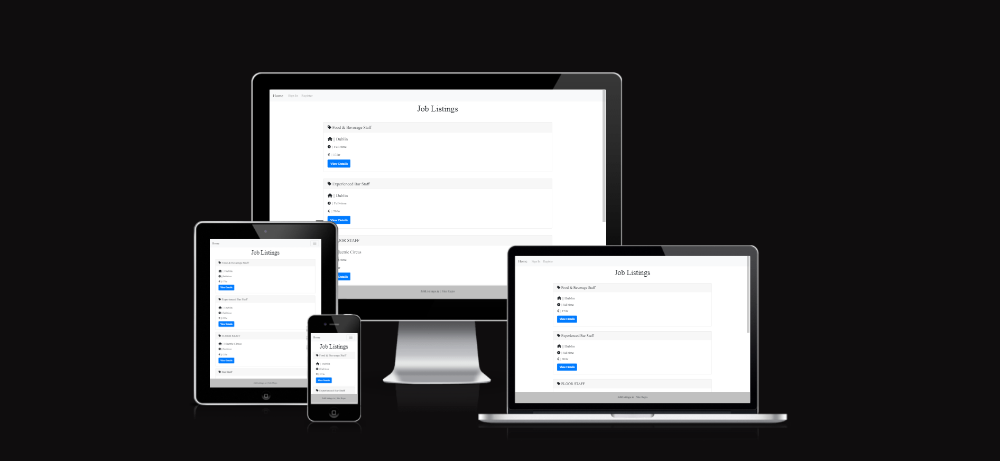

[Deployed-site](https://job-forum-ci.herokuapp.com/)

[Site-repo](https://github.com/NowickiLukasz/job-listing-site-ci-pp4)

# Table of content
1. [Planning](#planning)
    - [Site Aims](#site-aims)
2. [Scope](#scope)
3. [Structure](#structure)
    - [Database Schema](#database-schema)
    - [Wireframes](#wireframes)
4. [User Stories](#user-stories)
5. [Agile Development](#agile-development)
6. [Features](#features)
    - [Navigation](#navigation)
    - [Authorisation Pages](#authorisation-pages)
    - [Job Listing Page](#job-listing-page)
    - [Job Add Page](#job-add-page)
    - [Job Edit Page](#job-edit)
    - [Job Delete Page](#job-delete)
    - [Job Details/ Application](#job-details-page-job-application-page)
    - [Admin Job Drafts Page](#admin-job-drafts-page)
    - [Admin View Job Application](#admin-view-applications)
    - [User Profile](#profile)
    - [Edit Profile](#edit-profile)
    - [Unauthorised Page](#unauthorised-page---403)
    - [Pagination](#pagination)
    - [Messages](#messages)
7. [Testing](#testing)
8. [Deployment](#deployment)
9. [Tech Used](#tech-used)
10. [Sources](#sources)
11. [Credits](#credits)

## Planning
### Site aims
The aim of this site is the create a fictional company in need of employees. 

The site will have a single employer who will be able to add new job listings, edit current ones and delete ones that do not need to be advertised anymore. 

The Employer will be able to keep jobs in draft mode untill they are ready to publish them. 

While the Employer will be able to see the job applications from registered users. 
The user wil be able to view the job listings and select which eveer one they deem most suitable for themselves. 

They will be able to submit a cover letter to a specific job. 

## Scope
- Must have **USER** functions
    - User can login /logout
    - User can view job listings
    - User can apply for job listings
    - User can edit own profile page

- Must have **EMPLOYER** functions
    - Employer can login / logout
    - Employer can add job listings
    - Employer can edit job lisings
    - Employer can delete job listings
    - Employer can draft job listings
    - Employer can view job aplpications

- Should have **USER** functions
    - View landing page 
    - User can save jobs 

- Should have **EMPLOYER** functions
    - View how many saves of a job 

- Not recommended at this time
    - Direct text chat with employer/user
    - View amount of applicants for a job 
    - Attachment of CV file to the site 
    - Employer details 

    
## Structure

### Database Schema

Database Schema

 
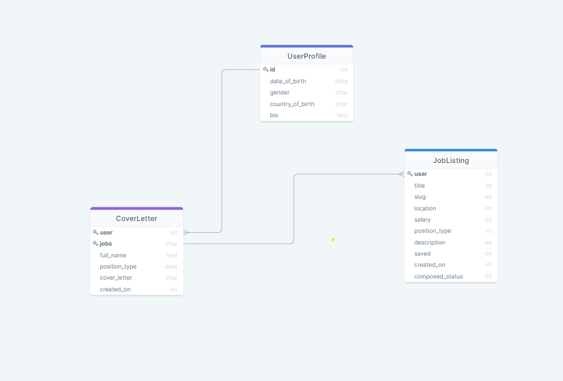

 

### Wireframes
The Original plan for the site was to create a site where multiple users could register and sign in as an Employer. 
This has been changed to reflect that the site is used by only one employer with multiple sites to advertise job offers.

Original plans did not contain a drafts page nor did they have a profile page included in the drawings. These ideas came during the creation of the project.

The use of images was not necessary as it would not bring much value to the site

Home Page

Home Desktop

 
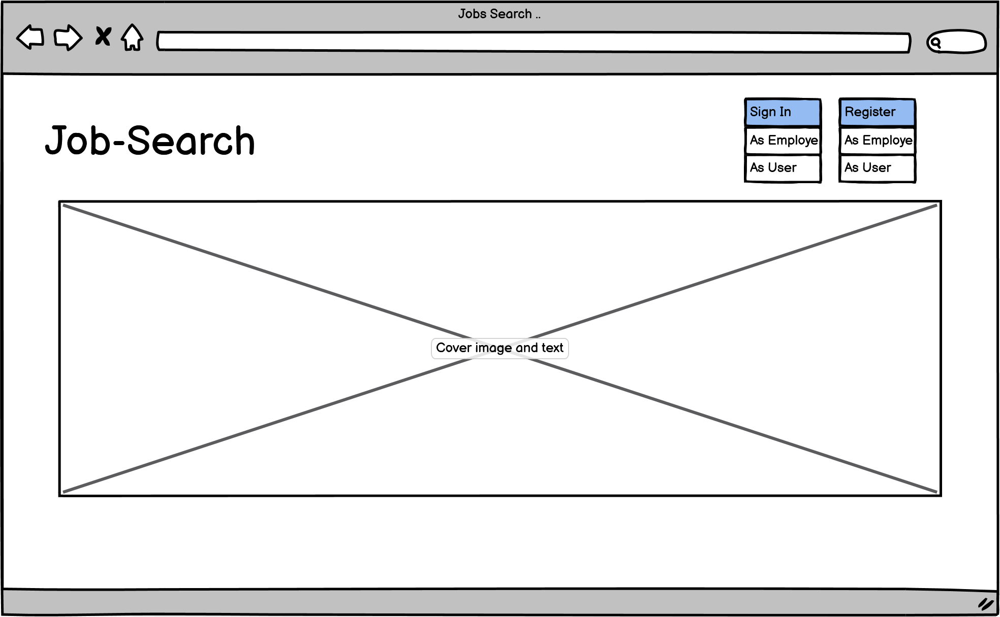

Home Mobile

 
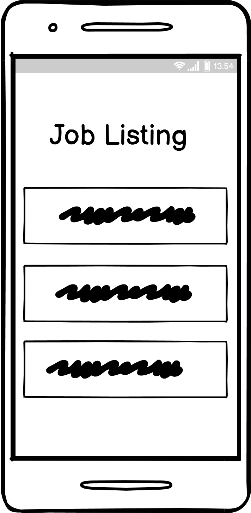

Sign In

Sign in Desktop

 
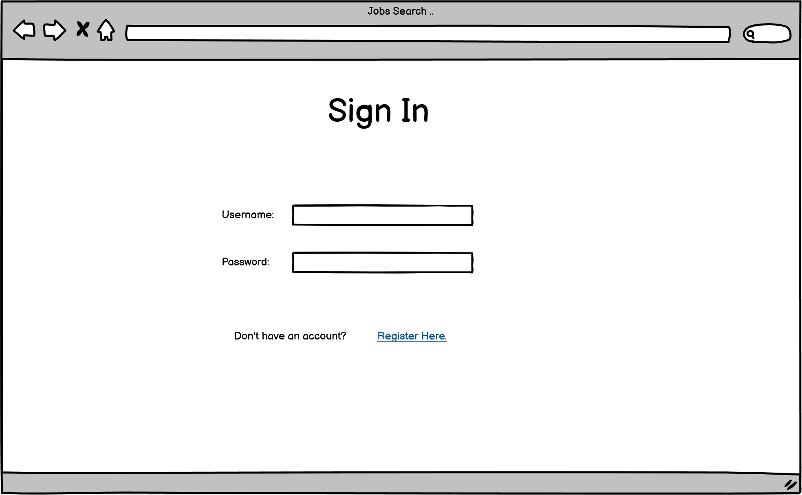

Sign in Mobile

 
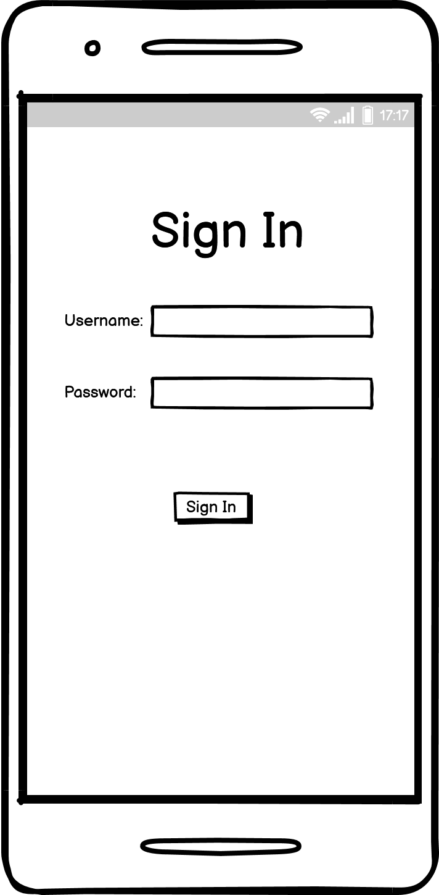 

 

Register Page

Register Desktop

 
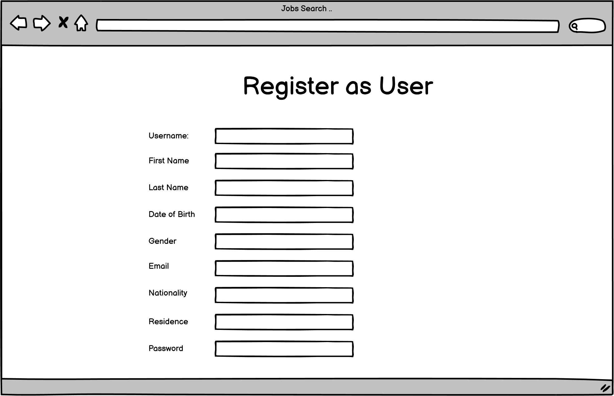

Employer Register Desktop

 
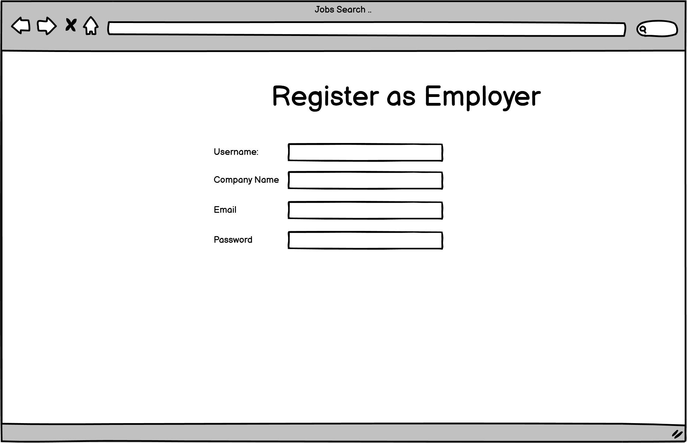

 Register Mobile

 
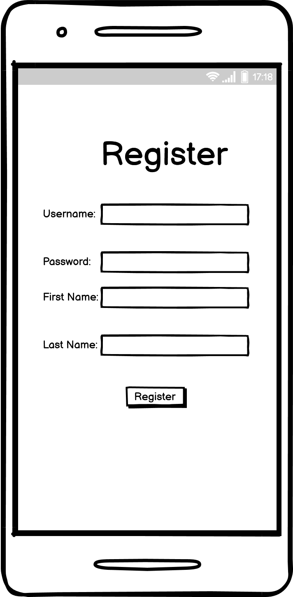

 

Job Listing Page

Job Listing Desktop

 
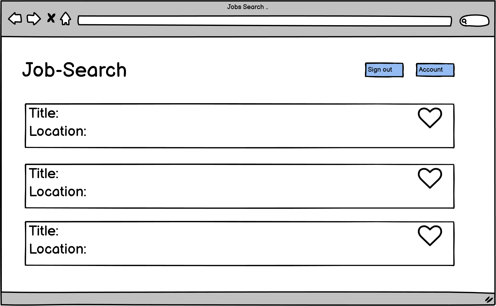

Job Listing Mobile

 

 

Job applications Page

Job applications Desktop

 
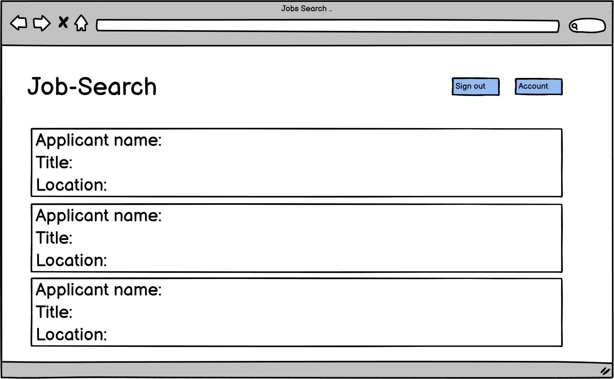

Job Application Mobile

 
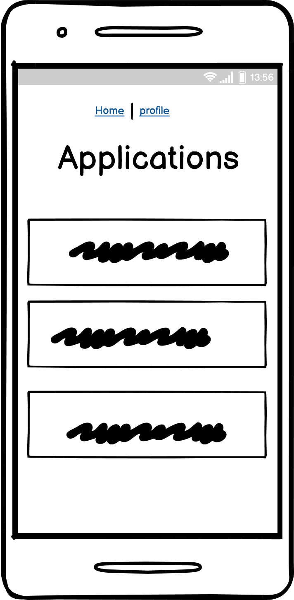

 

Job applications details page

Job applications details Desktop

 
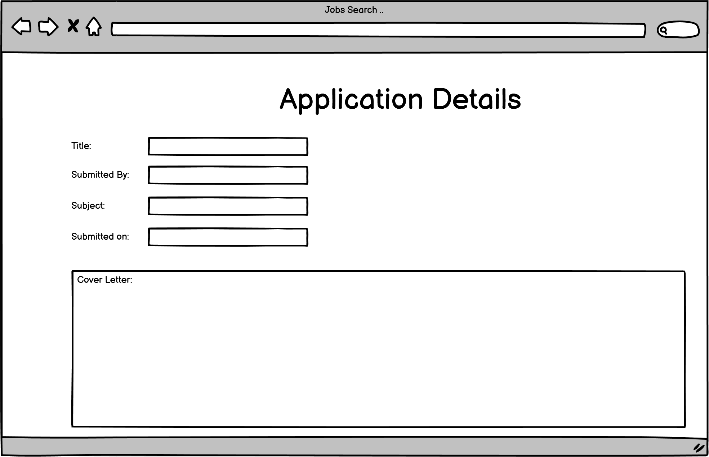

Job Application Details Mobile

 
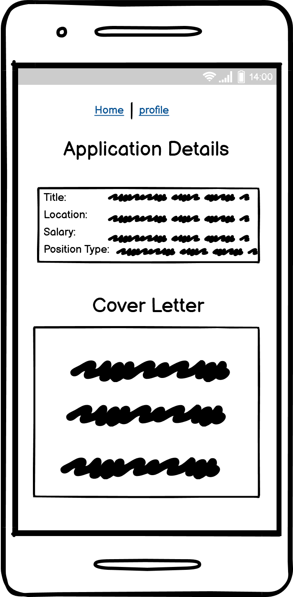

 

Add Job page

Add Job Desktop

 
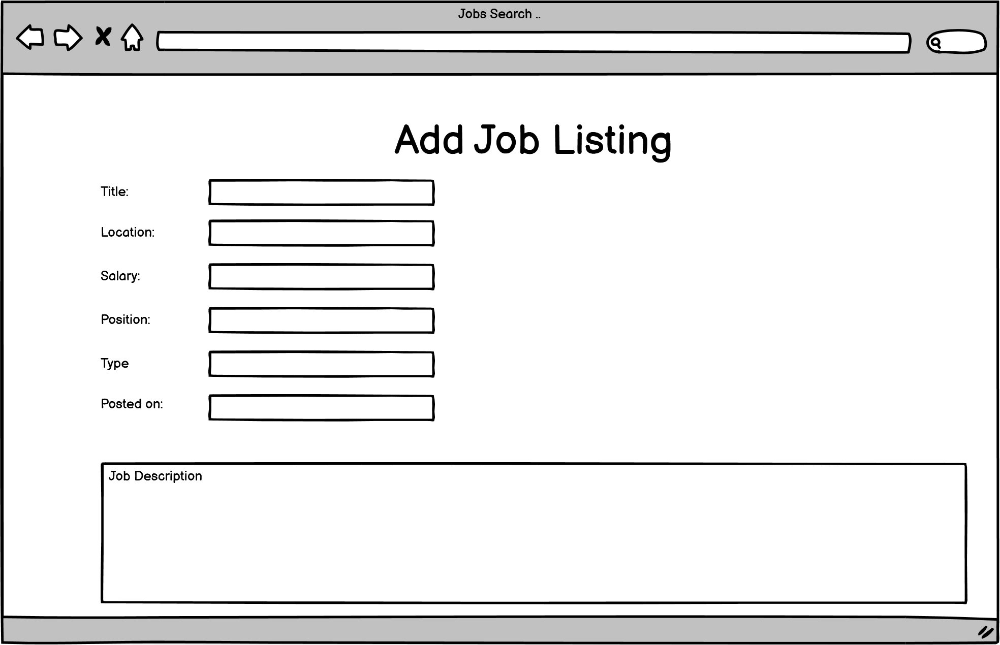

Add Job Mobile

 
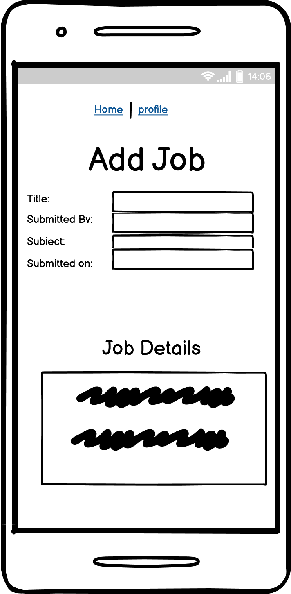

 

## User stories

| Number | User Story                 | Description                                                 | Competed    |
| :----: | :----:                     |    :----:                                                   |         :----:|
#1       | Register for the site      | As a USER I can REGISTER FOR THE SITE so that I CAN VIEW JOB LISTINGS       | Yes  |
#2       | Log in to site             | As a USER I can LOGIN TO THE SITE so that I CAN APPLY FOR JOBS THROUGHT THE SITE     | Yes  |
#3       | Log out of site            | As a USER I can LOG OUT OF THE SITE so that I CAN FINISH MY SESSION         | Yes  |
#4       | Edit account details       | As a USER I can EDIT MY PROFILE DETAILS so that I CAN HAVE AN UP TO DATE ACCOUNT      | Yes  |
#5       | View job listing           | As a USER I can VIEW JOB LISTINGS so that I CAN SEE THE DETAILS OF THE JOBS POSTED     | Yes  |
#6       | Save Job Listing           | As a USER I can SAVE A JOB so that I CAN COME BACK TO VIEW IT AGAIN TO APPLY     | Yes  |
#7       | Delete saved job           | As a USER I can DELETE A SAVED so that I CAN ONLY HAVE FAVOURITED JOBS IN MY SAVED PAGES  | Yes  |
#8       | Apply for a job            | As a USER I can APPLY FOR A JOB so that THE COMPANY CAN SEE MY AS A VIABLE APPLICANT     | Yes  |
#9       | Submit a cover letter      | As a USER I can SUBMIT A COVER LETTER so that MY EXPERINCE CAN ME SHOWCASED       | Yes  |
#10      | Create a job listing       | As a EMPLOYER I can CREATE A JOB LISTING so that PEOPLE CAN BE INFORMED ABOUT A JOB OPENING AND CAN APPLY       | Yes  |
#11      | Delete a job listing       | As a EMPLOYER I can DELETE THE JOB LISTING so that THE JOB WILL NO LONGER BE AVAILABE TO BE APPLIED FOR   | Yes  |
#12      | Update a job listing       | As a EMPLOYER I can UPDATE THE JOBLISTING so that IT CAN BE KEPT UP TO DATE  |Yes   |
#13      | View job applications      | As a EMPLOYER I can VIEW ALL JOB APPLICATIONS so that I CAN CHOOSE THE RIGHT APPLICANT        | Yes    |
#14      | View number of times a job listing has been viewed| As a EMPLOYER I can VIEW THE NUMBER OF TIMES A JOB HAS BEEN VIEWED so that I CAN KNOW IF THE JOB IS POPULAR| Future Features  |
#15      | View Cover letters| As a EMPLOYER I can VIEW THE COVER LETTER ONLY so that SO THAT NOBODY APART FFROM THE ADMIN CAN HAVE ACCES TO CONFIDENTIAL INFORMATION| Yes     |
#16      | Authorisation for editing and deletion| As a EMPLOYER I can HAVE THE AUTHORITY TO EDIT AND DELETE JOB LISTINGS so that NOBODY ELSE CAN ADJUST MY LISTINGS IN A MLICIOUS WAY        | Yes      |
#17      | View Job Listings   | As a USER I can VIEW JOB LISTINGS so that CHOOSE WHAT JOB I WAN TO APPLY FOR        | Yes      |
#18      | Add Job   | As a EMPLOYER I can ADD A NEW JOB TO THE LISTINGS so that I CAN ADVERTISE JOB OPENINGS FROM THE COMPANY        |  Yes    |
#19      |View and publish draft jobs| As a ADMIN I can VIEW, EDIT and PUBLISH JOBS so that NEW JOB LISTINGS CAN BE VIEWED BY THE APPLICANTS| Yes

## Agile Development
The agile methodology used in this project was a kan-ban board. 
This allowed to the set up of the user stories in 4 stages. 
First stage set up all of the tasks to be done.
Second stage showed all the tasks that were currently in progress.
Third stage was the completion of the tasks.
Fourth stage is reserverd for the use of future features. 

Kan-Ban Board

 
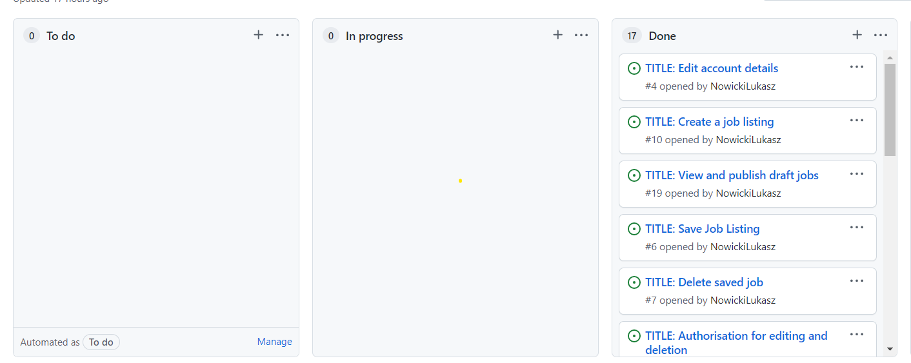

 

## Features

### Navigation
The navigation bar on the top of the page reflects 3 different stages of the site. 
First stage is for a user or admin that is not signed in. It shows an option to log in or register
    

Signed out

 
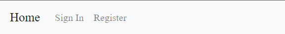

Second stage is that or a logged in user. The Nav bar then shows an option to edit user profile or view job listings

Signed in

 
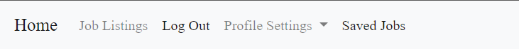

The third stage is where an ADMIN is logged in, this has more access to the site, it allows the admin to add a new job listing and view applicants for the jobs posted. 

Signed in as admin

 

 

### Authorisation pages 
For the site we have the ability to register and sign in for the site. This functionality is provided through the DJANGO framework and allows for automatic authorisation of the new or existing user. 

Sign In page

 
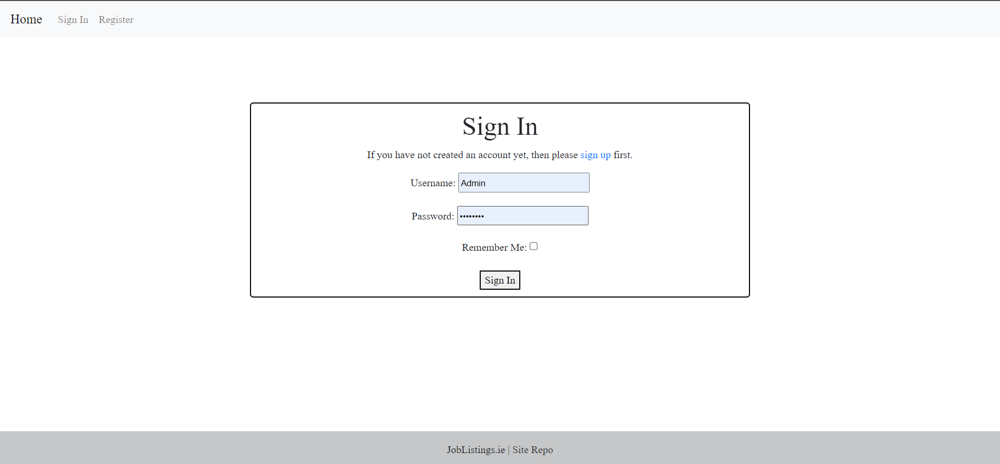

Sign Out Page

 
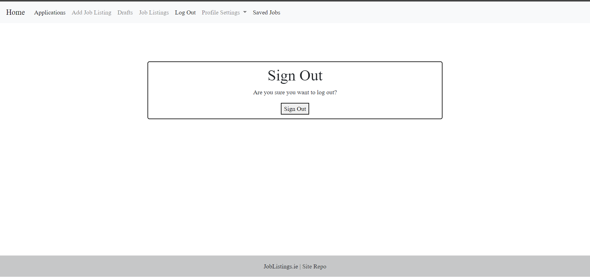

Register

 
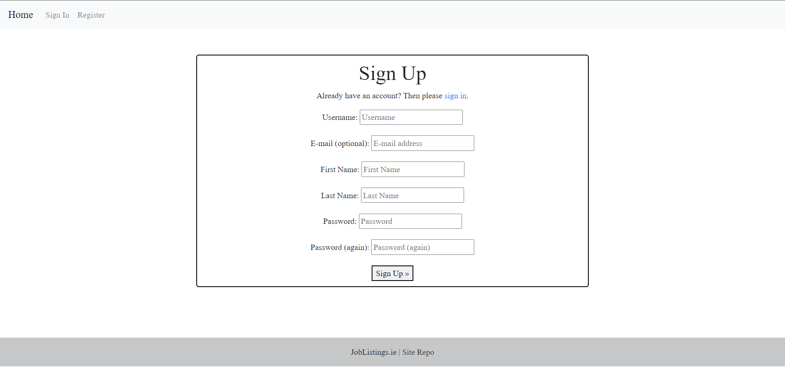

 

### Job Listing Page
The Job listing page is located in two sections of the site. 
First, it is seen on the home page of the site, where a user is greeted and encouraged to view jobs or to register for the site.
Once this is completed, the user may view the job listings with the ability to apply for jobs they find applealing.  

Job Listing Page

 
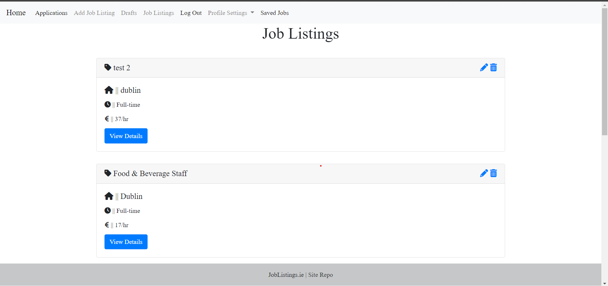

 

### Job Add Page 
The ADMIN had the sole role of adding new job listings to the site. 
The add job page has a form that contains all the fields which need to be filled out so that it can be validated and sent to a database. 

Job Add Page

 
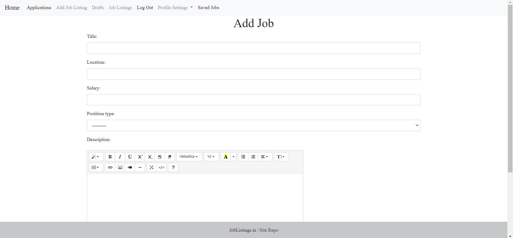

 

### Job edit
The ADMIN had the sole role of editing listings on the site. 
The page form comes prepopulated with the current details of the job and once all the relevant fields are updated, the form can be sent out to be re-listed on the site. 

Edit Job

 
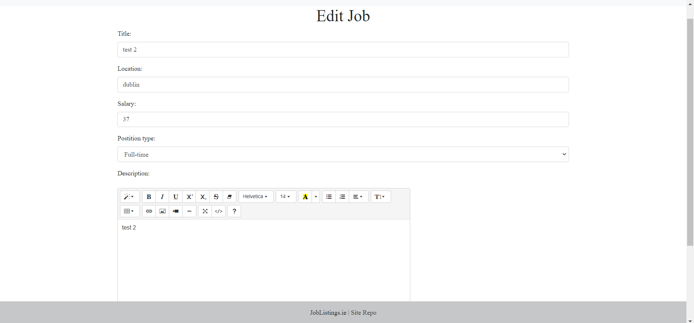

  

### Job Delete
The ADMIN had the sole role of deleting a job listings on the site. 
The page shows a warning message 

Delete Job

 
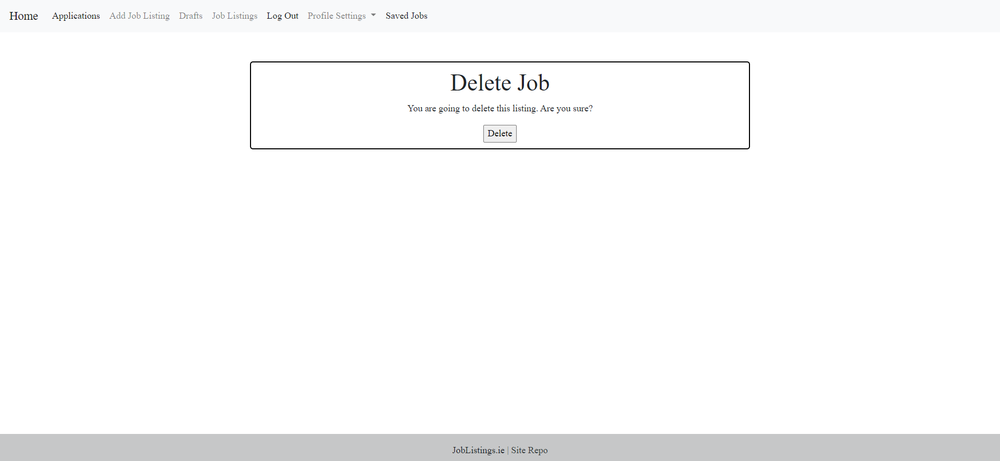

 
    
### Job Details Page/ Job Application Page
The details page shows the all the advertised details for the job. This page can be viewed if a user is logged in only.  
This page also has an application section. This section can only be viewed if the user is logged in. 

Job Details

 

 

Application Section

 
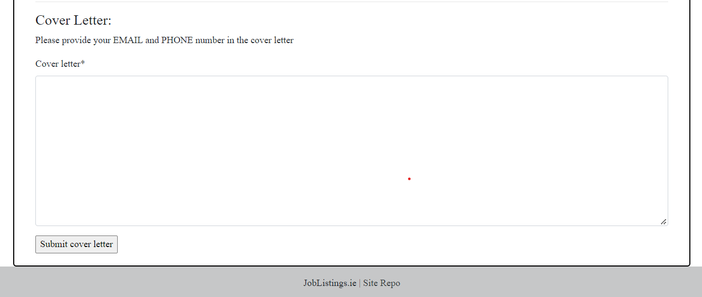

 

### Admin Job Drafts Page
The admin may view job listings that have not yet been published. The job listing then may be edited, deleted or published to the site so that new applicants may apply for the job.

Drafts

 
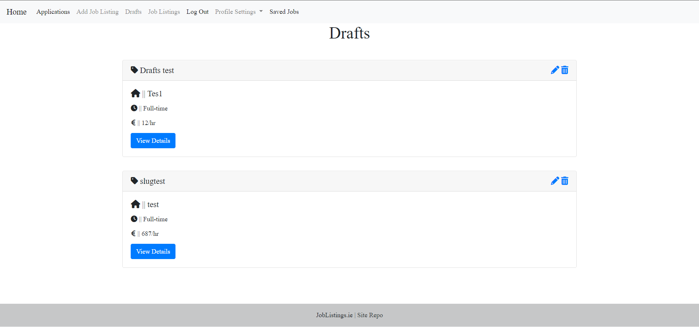

 

### Admin View applications
The Admin is solely able to view applications that have been submited by the users. 
This section allows the admin to view the details of the posted job, the cover letter and a link to the applicants profile

Job Applications Section

 
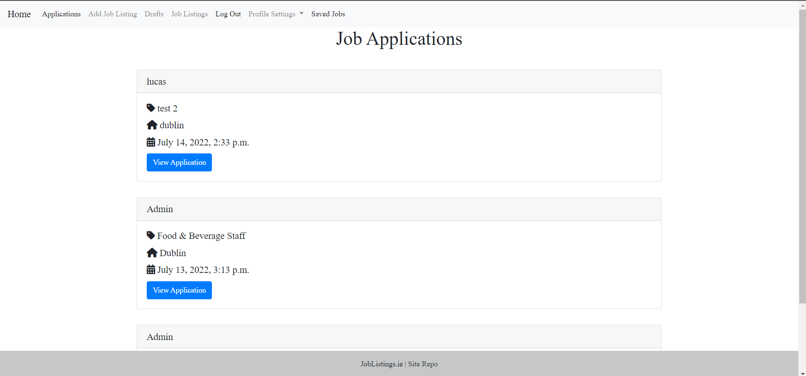

 

Job Application Details

 
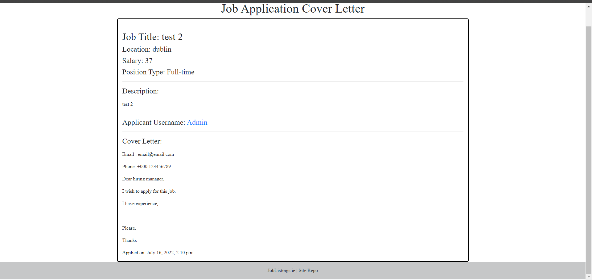

 

### Profile
Users may fill out their details in their own profile page. This page is linked to each job application they take part in. 

Profile Page

 
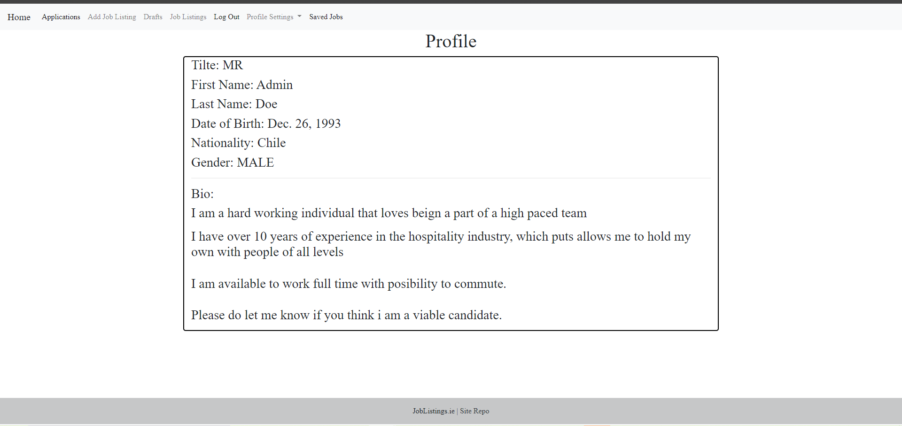

 

### Edit Profile
The user has the ability to update their profile details including their bio. 

Edit Profile Page

 
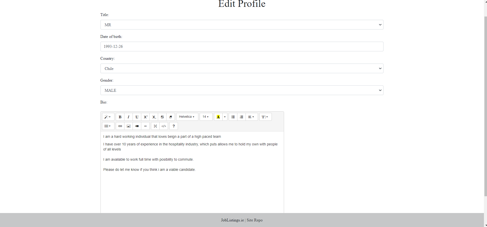

 

### Unauthorised page - 403
Any user that is not authorised to access sensitive pages will be shown a page with information to either go back hoome or to log in as page owner.

Not Authorised Page

 
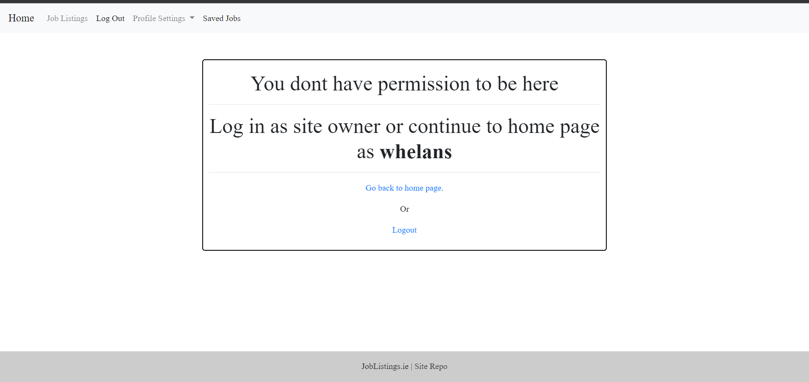

 

### Pagination
Pagination of the listings allows for the display of a limited amount of jobs on one page before being asked to go to the next page if there are more than 5 job listings. 

Pagination

 

 

### Messages
This section shows messages after user actions happen.

Added Job Message

 
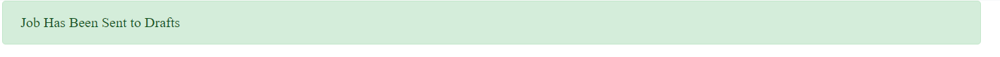

Added Job Updated Message

 
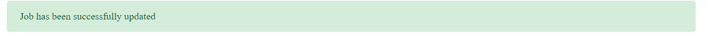

Profile Updated Message

 

Published Job Updated Message

 
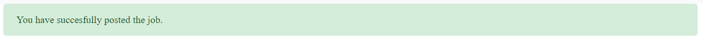

Signed in Message

 

Signed Out Message

 

## Testing 
The following is a link to acces the manual testing file
[TESTING.md](TESTING.md)

## Deployment
The following is a link to acces the deployment file
[DEPLOYMENT.md](DEPLOYMENT.md)

## Tech Used
* Python
  * The packages installed for the is project can be found in the [requirements.txt](requirements.txt)
* Django
  * Django was used as the python framework in the project.
  * Django all auth was used to handle user authentication and related tasks i.e. sign in, sign up, sign out.
* Heroku
  * Used to deploy the page and make it publicly available.
* Heroku PostgreSQL
  * Used for the database during development and in deployment.
* HTML
  * HTML was the base language used to layout the skeleton of all templates.
* CSS
  * Custom CSS used to style the page and make the appearance look a little more unique.
* Bootstrap 4.6.1
  * Used for the majority of styling throughout the document and for it's fantastic grid system. 
* Font awesome
  * All icons throughout the page.

## Sources

- Auto creating slugs for unpublished job listings
    - (https://stackoverflow.com/questions/50436658/how-to-auto-generate-slug-from-my-album-model-in-django-2-0-4)
- Auto creating user profile with signals
    - (https://ordinarycoders.com/django-custom-user-profile)
- Adding job listings to favourites
    - (https://www.youtube.com/watch?v=1XiJvIuvqhs&ab_channel=AbhishekVerma)

## Credits
- Inspiration taken from: how to build job portal
  - (https://techvidvan.com/tutorials/online-job-portal-python-django/)
- Inspiration taken from: How to build a blog
  - (https://www.youtube.com/watch?v=B40bteAMM_M&list=PLCC34OHNcOtr025c1kHSPrnP18YPB-NFi&ab_channel=Codemy.com)
- Messages 
  - (https://pythonprogramming.net/messages-django-tutorial/)
- Job Despriptions taken from.
  - (https://www.jobs.ie/)
    
    
