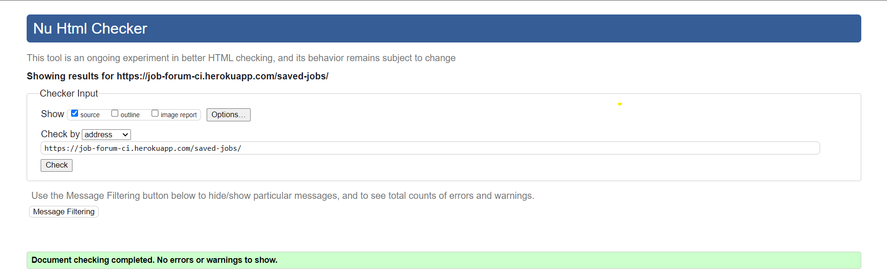

# Manual Testing

# Table of content
1. [Bugs found during testing](#bugs-found-during-testing)
2. [Testing](#testing-functionality)
    - [As an **Admin** I can](#as-an-admin-i-can)
    - [As an **Unregistered User**](#as-an-unregistered-user)
    - [As a **Registered User](#as-a-registered-user)
3. [LightHouse Testing](#lighthouse-testing)
4. [HTML Validator](#html-validator)
5. [CSS Validator](#css-validator)
6. [PEP8 Validator](#pep8-validator)
7. [Cross Browser](#cross-browser-compatablity)

# Bugs found during testing. 

|Bug | Edit profile in base.html returns a page not found error  |
|:-------:|:--------|
| Solution| Create a contexts.py file and connect up in base.html edit-profile url|

|Bug | When account is created and attempt to access user profile page, error on page not found. |
|:-------:|:--------|
| Solution| Create a signals.py file. This file connects the current created user withe the profile page and allows for connectivity in the bas.html page in order to access the user profile page.|

| Bug | Jinja templating throws dublication error of id's in html validator |
|:-------:|:--------|
| Solution | Change ID'd of container to class for styling purpose |

| Bug | Using Braces mixins, SuperuserRequiredMixin created a infinity loop when a non superuser tries to access a restriced site |
|:-------:|:--------|
| Solution | Create own class for SuperuserRequiredMixin, passing in UserPassesTest and LoginRequired. 

| Bug | Footer id is duplicated in the html validation |
|:-------:|:--------|
| Solution | Remove footer tags from bottom of base.html page as text below main section |

| Bug | Publish button in drafts.html does not function
|:-------:|:--------|
| Solution | Functionality was correct, function needed job.save() to complete the function|

| Bug | Summernote field to large for mobile screens and accepts images which throw error |
|:-------:|:--------|
| Solution | In Settings.py , create a SUMMERNOTE_CONFIG section where it is 100% width of the container, and remove non necessary editor functions. 

| Bug | Website titles do not show in tabs in browser |
|:-------:|:--------|
| Solution | Add block title to base.html meta title and add to all html templates |

# Testing functionality
## As an **Admin** I can...
This section is created for the admin panel testing only.

|Checked| Search for jobs via search bar |
|:-------:|:--------|
| &check; | Can Search for jobs by typing into search bar|

|Checked| Search for jobs filter status |
|:-------:|:--------|
| &check; | Can Search for draft or published jobs|
| &check; | Can Search for jobs by full-time status|
| &check; | Can Search for jobs by part-time status|
| &check; | Can Search for jobs by created time frame|

|Checked| Access the admin panel |
|:-------:|:--------|
| &check; | Can log into the admin panel|
| &check; | Can adjust the user details and information|

|Checked| Navigate admin panel to add, view, edit, delete jobs|
|:-------:|:--------|
| &check; | Can add new job listing |
| &check; | Can set a job as draft|
| &check; | Can set a job as published|
| &check; | Can delete job drafts |
| &check; | Can delete job listings |
| &check; | Can view all job applications |

This section is created for the admin front-end testing.

|Checked| Navigate jobs, add, view, edit, delete jobs|
|:-------:|:--------|
| &check; | Can add new job listing |
| &check; | Can set a job as published|
| &check; | Can view all jobs listed |
| &check; | Can view all job applications |
| &check; | Can view all job drafts |
| &check; | Can delete job drafts |
| &check; | Can delete job listings |
| &check; | Can view applicants profile page |

## As an **Unregistered User**...
This section is created for the unregistered user front-end testing.

|Checked| Register for an account |
|:-------:|:--------|
| &check; | I can register to the site|
| &check; | I can login to the site|
| &check; | I am restricted from accesing hidden pages|
| &check; | I am restricted from making dupicate accounts with username or email|
| &check; | I am restricted from viewing job details without being logged in|
| &check; | I can view job listings|

## As a **Registered User**...
This section is created for the registered front-end testing.

|Checked| Browse job listings to view job details and apply for job |
|:-------:|:--------|
| &check; | I can view all published job listings|
| &check; | I can view details of individual jobs|
| &check; | I can apply for jobs by submiting a cover letter|
| &check; | I can view my profile page|
| &check; | I can edit my profile page|

|Checked| Save jobs to apply at a further time |
|:-------:|:--------|
| &check; | I can save a job to be applied for at later stage|
| &check; | I can view saved jobs|
| &check; | I can delete a saved job if i dont want to apply for it or i am not interested anymore|

|Checked| Validate my input |
|:-------:|:--------|
| &check; | I can have all of the forms be validated so that they can be submited|

|Checked| Access only the pages I have permissions for |
|:-------:|:--------|
| &check; | I will be unable to access pages with sensitive information|

|Checked| Access the site from any device |
|:-------:|:--------|
| &check; | The Site has been tested with Chrome developer tools for site repsonsiveness.|
| &check; | The Site is responsive on mulitple mobile devive sizes|
| &check; | The Site is responsive on mulitple desktop screen sizes|

# LightHouse Testing
Desktop Validation

Home page

 

Applicants Page

 

Application Details Page

 

Drafts Page

 

Drafts Detail Page

 

Login

 

Logout

 

Register

 

Profile

 

Edit Profile

 

Favourites

 

 

# HTML Validator

Home page

 

Applicants Page

 

Application Details Page

 

Drafts Page

 

Drafts Detail Page

 

Login

 

Logout

 

Register

 

Profile

 

Edit Profile

 

Favourites

 

 

# CSS Validator

CSS

 

 

# PEP8 Validator
All user created python files have been tested and passed all pep8 complience.

# Cross browser Compatablity
The site has been tested on 
    - Google Chrome
    - Opera Browser
    - Edge Browser

